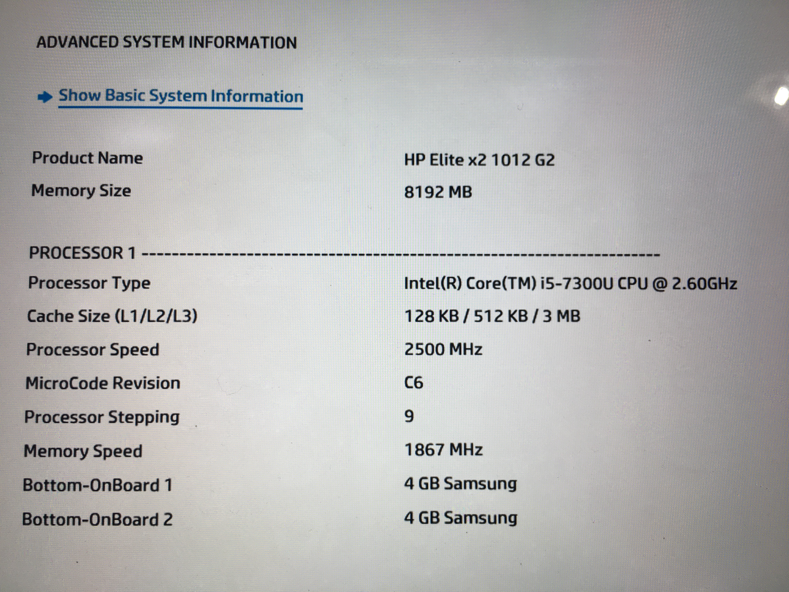
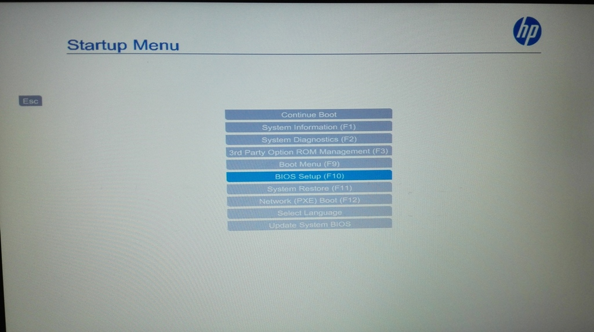
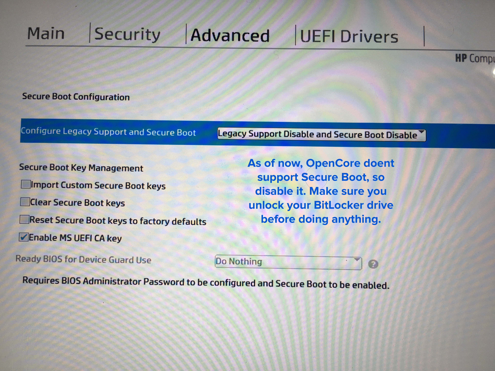
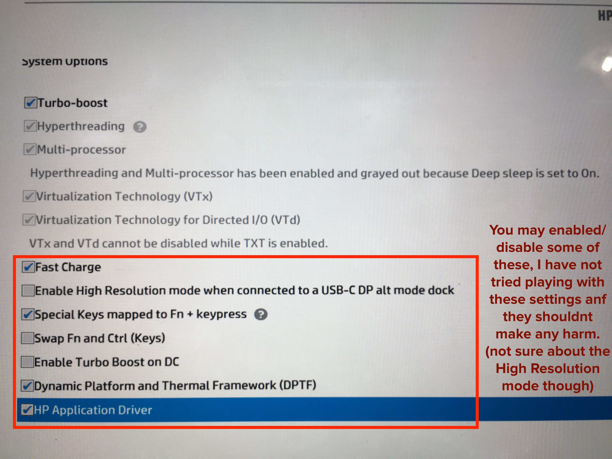
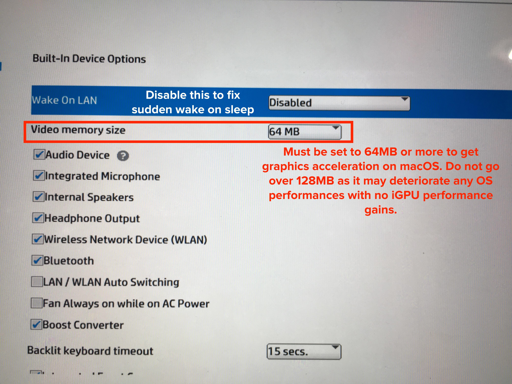
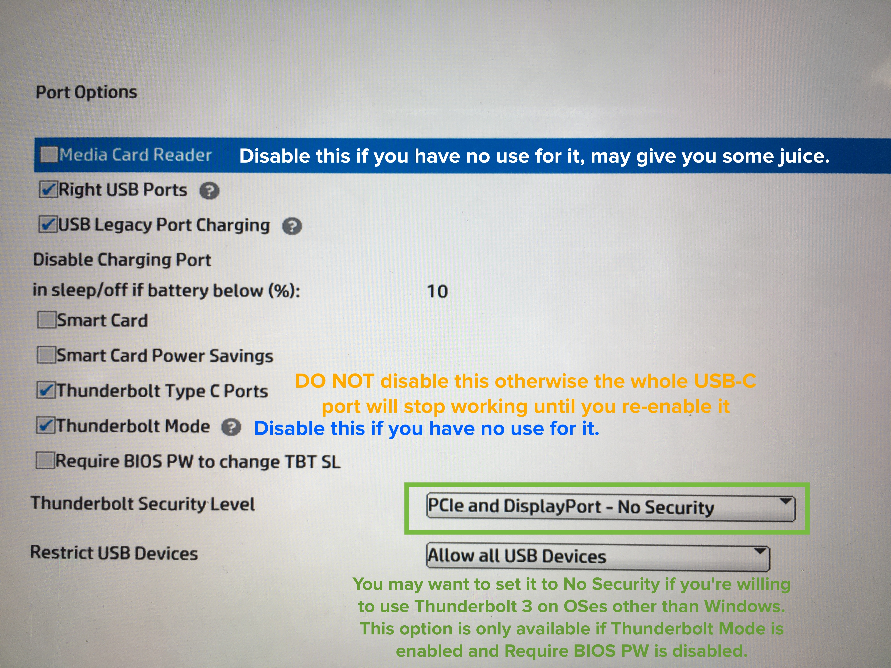
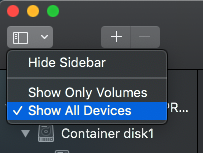

# X2 1012 G2 macOS install with OpenCore

## Intro

I've been able to install macOS on the HP Elite X2 1012 G2 through OpenCore. This guide will go through the setup on how to get it working but will not include any files other than ACPI and parts of the config, you will have to do the work youself.

---

## Disclaimer

THIS GUIDE IS PROVIDED TO YOU FOR EDUCATIONAL PURPOSES AND THIS I AND ANYONE MENTIONED DIRECTLY OR INDIRECTLY IN THIS GUIDE WILL NOT BE HELD RESPONSIBLE FOR ANY HARM OR LOSS. BY FOLLOWING THIS GUIDE YOU AGREE TO TAKE FULL RESPONSIBILITY FOR ANYTHING THAT COMES OUT FROM THIS GUIDE.

---

## My Hardware

- Model: HP Elite X2 1012 G2
- CPU: Intel Core i5 7300U 2.7GHz Dual Core - Four Threads CPU (vPro)
- GPU: Intel HD620
- 8GB LPDDR3 RAM (soldered)
- 500GB WesternDigital SN500 SSD (NVME PCIe*2) (1.7GB/s read, 1.4GB/s writes for 60GB, 800MB/s sustained, DRAMless, one-sided PCB)
  - ⚠️ The tablet only accepts one sided PCBs, basically all chips should be on one side and the other should be flat
  - From experience a SATA SSD would be cheaper, and even macOS wont cry about it, but I got this for a good price so I'm not really complaining ¯\\_(ツ)\_/¯
  - Had a 256GB SATA M.2 Sandisk drive.
- Wifi Card: **was** Intel Wireless Dual Band 8365 (for vPro), replaced with **DW1560**.
  - ⚠️ The Slot is an A slot, WILL NOT handle E keyed cards unless you Dremel it, get the proper card
  - ⚠️ DW1820A is problematic on this machine (still investigating it)
- LGE Display IPS 2736x1824 3:2 @60Hz
- Touch Panel: WCOM483E I2C Wacom Touch&Pen AES
- Audio: Conexant CX8200
  - Trash speakers
- Thunderbolt 3 Chipset: JHL6540
  - probably wont work atm, still investigating it
- NO LTE modem, so I cannot help you with that
- OSes: macOS 10.15.x - Windows 10 - Ubuntu - ChromeOS
- 
- 

### What's working

Thankfully with OpenCore a lot of things got smoothed out and works just as you would expect:

- CPU Power Management
- GPU Power Management
  - With QE/CI
- Battery %
- USB type A port
  - USB Power output up to 10W for iDevices
- USB type C port
  - Only DP-Alt mode and USB mode
- WiFi/Bluetooth (AirDrop, Continuity, Handoff, will require you to configure macOS properly for that)
  - Needs compatible WiFi card
- Audio In/Out
  - Microphones
  - Headphone (just audio out, the onboard microphone is used)
  - Speakers
- Touch
  - As a giant trackpad
  - Pen input (no pressure support)
- Keyboard cover USB trackpad (yes it's USB)
- Keyboard hotkeys
  - Note that you may want to do a fresh Windows re-install to get the brightness keys working on both OSes, HP's keyboard software breaks it.
- Sleep/Wake/Shutdown/Reboot
- Startup Disk/Bootcamp reboot
- FileVault
- HEVC encoding
- Apple Services (AppStore, iMessage, FaceTime, iCloud...)
  - Given that you use properly generated SNs

### What's not working

- Cameras (they're connected through I2C or whatever to the iGPU through some weird stuff, not even working on linux)
- Fingerprint reader (disabled with USBMap)
- SDCard reader (the available driver causes crashes and isnt stable enough)
- Thunderbolt 3
  - There are some efforts to make it work
  - Will only work if you plug the device before booting up
  - I was successful to make it load up in OS but you will lose USB functionalities after wake, so it wasnt worth the effort, the DP-alt mode works
  - I do not own any Thunderbolt 3 device, so I only tested through force_power
  - Still causes KP ocasionally
  - May require to flash a custom firmware in the Ti chip but I am not going to go that far
- Accelerometer/Gyro (no drivers available and it's not I2C connected)
- Light Sensor (Investigating it, there may be a chance with VirtualSMC's plugin SMCLightSensor)

### What's working badly/did not test

- USB-C port
  - Only USB/DP-alt mode no Thunderbolt 3 support as of yet
- Power consumption
  - it's quite a hungry OS, the fans are always on most of the time
  - idles at 1-3W
  - can be fixed by disabling unsused devices above
  - I can get up to 4-4h30 of light usage and down to 2 hours if I'm pushing it hard (aka rendering things, using 3D software)
- DRM support - not tested/fixed
  - I dont use iTunes/TV+
  - Netflix on Safari may not work (didn't test)
    - Works on Chrome/Firefox just fine
- Pen Pressure input, only works on 10.11 (you will have to do more work to get this running on 10.11, not covered here)
- *to be filled when I remember something*

---

## Installing macOS

### Preparing your computer

Before installing macOS, you'll have to prepare your computer.

1. ⚠️ **BACKUP EVERYTHING**, I will not take responsibility of anything that happens to your data.
2. If you're dual booting with windows:
   1. [Disable BitLocker](https://www.tenforums.com/tutorials/37060-turn-off-bitlocker-operating-system-drive-windows-10-a.html#option2) if you have it enabled already.
   2. Download a disk partitioning tool (like Minitool Partition Wizard, EaseUS, Aomei...), I DO NOT recommend Gparted as it may break NTFS and can create partition overlapping if you're not careful (if you're ok with it and sure about it, go for it).
   3. Resize your C: partition to leave at least 60GB from the right (because windows will be broken if you resize from the other side)
      - In case there are any partitions after the free space, move them at the end of the Windows partition (usually it's Recovery)
      - In case the EFI partition is less than 100MB, make it larger by shrinking the windows partition from the side of the EFI by the amount you need to grow it and some more.
        - This is crucial as it will help use format it with APFS later on.
   4. Create an empty FAT32 partition in that free space (CRUCIAL, as macOS doesn't see "empty" space.)
3. Boot to the Firmware Setup (AKA, BIOS Setup), use one of these methods
   - Open Start > Settings > Updates and Security > Recovery > Advanced Startup > Troubleshoot > Advanced Options > **UEFI Firmware Settings**
   - Shutdown the tablet, press the power button once and quickly hold the Volume Down button until you see the HP Startup Menu screen, select BIOS Setup.
   - Shutdown the tablet, attach a keyboard, press the power button and 
     - Quickly hold ESC until you get HP Startup Menu, select BIOS Setup
     - Quickly hold F10 until you get to the BIOS Setup
     - Quickly hold F9 until you get to the Boot Menu, press Esc to return to the menu before it, select BIOS Setup
   - If you're using GRUB2/Systemd-boot, select Boot Firmware Setup.
   - 
4. Configure your BIOS settings as shown in these pictures:
   - Note that only the selected parts are very important to the setup, the rest can changed depending on your needs.
   - Note that **YOU DO NOT** need to be on the latest BIOS release, it's not really needed, but if you want more security, you may want to update it.
   - **Security Tab**
     - 
   - **Advanced Setup tab**
     - **Boot Options**
       - 
     - Secure Boot
       - 
     - System Options
       - 
     - Built-in Devices Options
       - 
         - This is called normally DVMT-prealloc, and macOS drivers will only work if it's 64MB or larger, so either choose 64 or 128.
       - 
     - Ports Options
       - 
     - Power Management Options
       - 
     - Remote Management Options
       - 
5. Press F10 when done to save and reboot. Make sure you can boot into Windows.

Ok, so I know that some of you may have a macOS machine nearby and some may not so I got the guide for both. The setup overview will be something like this:

1. Prepare a vanilla bare macOS installer
2. Install macOS and get it booting
3. Add extra stuff from this guide

### [OpenCore Guide - khronokernel aka Hackintosh Slav (boomer-chan)](https://khronokernel.github.io/Opencore-Vanilla-Desktop-Guide)

- Please follow the guide properly, and read it fully before doing anything and prepare the needed hardware (you can skip WiFi card replacement).
- Make sure you tablet is charged properly
- **Use USB2.0 drives**
- Make sure you have a spare USB keyboard/mouse just in case and a USB type A hub
- **Changes** that are needed to do from the guide:
  - You can use [ProperTree](https://www.github.com/corpnewt/ProperTree) on windows/linux to make OC's config.plist
  - Gathering Files:
    - Firmware Drivers
      - Use `HfsPlus.efi` instead of `VboxHfs`, it's faster and it's Apple's official driver dumped from real Macs firmware.
      - Do not use `UsbKbDxe`, our keyboard is PS/2
      - `FwRuntimeServices` may be integrated in the OpenCorePkg zip in future releases.
    - Kexts
      - You do not need to use SMCSuperIO/LightSensor/BatteryManager
      - No need for an ethernet kext (as you guessed it, because you don have one, USB ethernet adapters have their own OEM drivers or may work OOB)
      - You need VoodooPS2 (acidanthera) driver found [here](http://kexts.goldfish64.com/) (source code [here](https://github.com/acidanthera/VoodooPS2)), in case it didn't work for you, you can use Rehabman's releases (same repository). This driver will enable your PS/2 keyboard (yes the keyboard is PS/2) to be used by macOS.
      - 
    - SSDTs:
      - Take from this guide these files:
        - SSDT-PLUG
          - Will enable native power management
        - SSDT-EC
          - Adds a fake EC (embedded controller) device named `EC__` as macOS Catalina actually needs it named like this
          - Will enable 10 W USB port output together with SSDT-USBX (later in the guide)
- Follow the **KabyLake** route, with these changes:
  - You do not need to type every `Add` entry manually, you can throw the files in their respective folders and then open your config.plist with ProperTree and then select File > OC Snapshot > Choose your OC folder > OK > all Add fields will be filled.
  - Keep `Kernel > Add`, `ACPI > Add`, `UEFI > Drivers`  sections as they are, they will be properly populated with OC Snapshot, just make sure the files are in place
  - Under `DeviceProperties` > `PciRoot(0x0)/Pci(0x02,0x0)` can be emptied or commented out. We will fix the Audio and Type-C DP output later. The other entries can be removed.
  - Under `Kernel` > `Quirks`:
    - `AppleXcpmCfgLock` set to YES/TRUE
      - The CFG-Lock option in our firmwares isn't showing up to the user, can be disabled through different means, but that can be a bit tricky.
      - This also permits CPU Power Management to work
    - `LapicKernelPanic` set to YES/TRUE, not really required but doesn't harm
    - `XhciPortLimit` set to NO/FALSE, there is no need to patch the driver for more than 15 ports, as our ACPI already defines a small number of ports to use and thus not getting over that limit.
  - Under `Misc` > `Debug` > `Target` set it to 
    - `0` for no OpenCore debug output (**not recommended** for debugging purposes), do that when you're done with this guide and get macOS fully setup
    - `67` (bits 0, 1, 6 in the Configuration.pdf of OpenCore documentation) will allow you to see the debug output and will save it in a file in your EFI partition/Boot partition (in case of a FAT32 USB)
    - `69` (~~noice~~ bits 0, 2, 6) will allow you to log the debug output in a file and in DataHub (no screen output) -- **recommended** for us because debug output can be a pain to get through because of how slow the UEFI framebuffer in our machines is with such a high resolution screen (try `67` to understand why)
    - `71` (bits 0, 1, 2, 6) will output debug log in screen, in DataHub and in a file.
  - Under `NVRAM` > `Add` > 
    - `4D1EDE05-38C7-4A6A-9CC6-4BCCA8B38C14` > `UIScale` > `02`
      - Will enable HiDPI for macOS boot logo and FileVault.
    - `7C436110-AB2A-4BBB-A880-FE41995C9F82`
      -  `csr-active-config` > `00000000`
        - Will keep SIP enabled (for security purposes)
        - However it will limit system files modifications (which is good) and will not let us add extra HiDPI resolutions to macOS (later in the guide).
      - Remove `nvda_drv` (for Nvidia web drivers) and `prev-lang:kbd` (for keyboard language, in case you need it, keep it and choose your layout from the guide).
  - Under `PlatformInfo`
    - In case you already have macOS installed on this device and just want to transfer your data to OpenCore, you can either copy the values from your Clover config.plist or use [GenSMBIOS](https://www.github.com/corpnewt/GenSMBIOS) to get the used values (Option 5) and put them in OpenCore's config.plist (including the ROM)
      - ⚠️ For this case please make sure you sign out from ALL Apple services in your macOS under Clover (including but not limited to: iCloud, AppStore, iMessage, FaceTime, Game Center...)
    - In case this is a new setup, the SMBIOS mode you're trying to generate values for is `MacBookPro14,1`
      - This SMBIOS will permit us to have proper CPU Power Management and behavior of the OS in general.
  - Under `UEFI`
    - Under `Quirks`
      - `RequestBootVarFallback` set to NO, there is no need for such option
- When done, make sure you check everything again before starting.

### You're good to go and start your macOS installer

1. You can boot your OpenCore drive by starting your tablet to the Boot Menu
   - By starting the tablet as shown above to the HP Startup Menu
   - By starting the tablet while holding F9/ESC
2. Boot your OpenCore USB
3. When you get to the OpenCore Boot Picker, **quickly press the number for macOS recovery/installer**
4. After macOS Installer starts up, select Disk Utility
   1. Select View > All Devices 
      - 
   2. Select the partition you made earlier
   3. Select Erase
   4. Select APFS as format and name the drive whatever you want
      - 
   5. Select Erase
      - ⚠️ Disk Utility can suddenly crash and go back to the main menu, just wait like a minute or two, open Disk Utility again and see if the drive has been formatted
   6. Close Disk Utility once done and select Install macOS and install macOS obviously.
   7. The installer may reboot several times (at least once) and will automatically choose the drive to boot from, do not select/change the boot order. Make sure you start your USB drive on each reboot, you can do that automatically by moving the USB boot entry in Boot Options in your BIOS Setup to the top of the list order.
   8. Once macOS installed and get to the desktop (make sure you skip Apple Account login) you can now:
      1. Download [MountEFI](https://github.com/corpnewt/MountEFI) and install the Automator Quick Action
      2. While in Finder, click on Finder > Preferences > General > Show these items on the desktop > Hard disks and External disks
      3. You will see your SSD's partitions on the desktop, right click on the macOS partition > Quick Actions > Mount EFI > type in your password when you get the prompt. Your SSD's EFI will show up.
      4. Copy `Your USB's FAT32 partition` > `EFI` > `BOOT` and `OC` to `Your SSD's EFI` > `EFI` > `.`
         - Go `Your SSD's EFI` > `EFI` > `Boot`, rename OC's BOOTx64.EFI to BOOTxOC.EFI (this is so that it doesn't get overwritten after Windows Updates/Linux Grub2 Updates)
      5. Reboot to the Boot Menu (F9)
      6. Select "Select an EFI file" and go to EFI > OC > Tools > Shell.efi
      7. Once you're greeted with the shell
         1. Type `map -b`, usually you'll find the first partition listed is the FAT32 readable partition, should be named `FSX:` where X is a number
         2. Type `FSX:` 
         3. Type `bcfg boot add 00 FSX:\EFI\BOOT\BOOTxOC.EFI "OpenCore Booter"`
            - bcfg: Manages the boot and driver options that are stored in NVRAM. -- UEFI Spec sheet
            - boot: what bcfg needs to change
            - add: add entry
            - 00: entry order in the list (00 being the very first entry)
            - FSX:\EFI...: path to the EFI file
            - "OpenCore Booter": name of the entry, you can choose whatever you want as long as it's 3 characters long and with the quotes.
         4. Press Ctrl + Alt + Del and your tablet will reboot
      8. After that a new entry for the BOOTxOC is made and your tablet will boot to OC automatically.
         - Note that in the even of a Windows Update "replaces your EFI" (which it totally does NOT), you can simply check the boot order in the BIOS Setup > Advanced > Boot Option and change the order as you see fit, or if suddenly the entry vanishes, you'll have to redo the steps above
         - I have yet to get this kind of issue
         - OpenCore's NVRAM clearing will reset the EFI boot entries to the defaults, rerun the above after an NVRAM clearing

### Fixing macOS and friends

After installing macOS, getting OpenCore to boot, it's time to get the rest of it to work. In this repository you'll find a bunch of SSDTs with a plist for patches that comes with SSDTs (if needed). Note that these ACPI files are made with my machine in mind (the CPU, RAM, SSD differences do not matter), and depending on your motherboard revision and your UEFI Firmware version/variation/revision, you may need to change things, but usually you wouldn't need to but just in case, I'll link many resources to get information to fix things on your end.

#### ACPI Fixes

| SSDT File Name | Patch(es) to use with                                        | Reason to use                                                |
| -------------- | ------------------------------------------------------------ | ------------------------------------------------------------ |
| SSDT-BAT.aml   | - GBAW to XBAW - GACW to XACW - BTIF to XTIF - BTST to XTST - ITLB to XTLB - GBTI to XBTI - GBTC to XBTC - SBTC to XBXC - GCGC to XCGC - NTBI to XTBI | Battery patches to get battery reading in macOS. The SSDT has the patched OperationRegions + Methods, the OC patches rename the original methods to something else so that macOS uses the new patched methods in the SSDT. |
| SSDT-XOSI      | _OSI to XOSI                                               | Renames the _OSI (Operating System Interface Level) method so that we can add macOS identification in the SSDT, this way, features that would only be enabled if Windows was detected would be also available for macOS. In our case it's mostly the I2C controllers. |
| SSDT-PNLF      | *none*                                                       | Fixes brightness by adding a PNLF device.                    |
| SSDT-EC        | *none*                                                       | Adds a fake EC device (embedded controller) named `EC__`, this fixes macOS Catalina's boot issue. More about that [here](https://www.reddit.com/r/hackintosh/comments/den28t/whats_new_in_macos_catalina/). |
| SSDT-DMAC      | *none*                                                       | macOS looks for the DMAC device, so we added it.             |
| SSDT-PMCR      | *none*                                                       | Learn more [here](https://github.com/jardenliu/XPS15-9560-Catalina/blob/master/CLOVER/ACPI/patched/SSDT-PMCR.dsl). |
| SSDT-TBHP      | RMV to XRMV                                                  | Enables USB Type-C hotplug. More about that later in the guide. |
| SSDT-TPL0      | - PS3 to XPS3 in TPL0 - PS0 to XPS0 in TPL0             | Fixes the touchscreen unresponsiveness after wake. (Thanks to jhax01) |
| SSDT-SBUS-MCHC  | *none* | Adds SBUS and MCHC devices, needed for macOS. |
| SSDT-NVME | *none* | Adds Power Management properties when using NVMe drives, idk really if that actually works, but it's not really doing anything bad either. |
| SSDT-PLUG | *none* | Adds `plugin-type` property to the CPU scope device, helps with CPU Power management. Contains CPUFriend Data. |
| SSDT-USBX | *none* | Adds USB properties for AppleBusPowerController for the USB ports, helps with the 10 W output support. |
| SSDT-MEM2 | *none* | Learn more [here](https://github.com/jardenliu/XPS15-9560-Catalina/blob/master/CLOVER/ACPI/patched/SSDT-MEM2.dsl) |
| SSDT-PTS  | Method(_PTS,1,N) to ZPTS | Adds XHC.PMEE fix, helps with the restart after shutdown. |
| SSDT-SLPB | *none* | Adds power button, I'm not sure if it fixes anything for anyone else. |
| SSDT-HP-FixLidSleep | *none* | Fixes e005 spam when putting laptop to sleep. |
| SSDT-ISHD | *none* | Disables ISHD when in macOS. |
| SSDT-VOL_KEYS | _Q30 to XQ30 | Fixes volume buttons on the side to actually do their job. (thanks to jhax01) |
| *none* | GPRW 0x6D, 0x04 to GPRW 0x6D, 0x00 | Attempts to fix usb wake, I recommend you disable it and try enabling and re-disabling USB Wake in your firmware to get it fixed. |
| *none* | SAT0 to SATA | In case you're using a SATA M.2 SSD, this would rename the SATA device in ACPI to what macOS ACPI Interpreter likes, may help with SATA power management. |
| *none* | RTC Fix | Fixes RTC issues in macOS, you would get a "CMOS Clock Error" on shudown/restart, this fixes it. (thanks to Rehabman) |

#### Kernel Extensions (Kexts)

| Kext | Use            | Depends on | Source | Download link |
|------|----------------|------------|--------|---------------|
| Lilu| An open source kernel extension bringing a platform for arbitrary kext, library, and program patching throughout the system for macOS. | *none* | https://github.com/acidanthera/Lilu | https://github.com/acidanthera/Lilu/releases |
| VirtualSMC | Advanced Apple SMC emulator in the kernel. | Lilu | https://github.com/acidanthera/VirtualSMC | https://github.com/acidanthera/VirtualSMC/releases |
| WhateverGreen | Various patches necessary for certain ATI/AMD/Intel/Nvidia GPUs | Lilu | https://github.com/acidanthera/WhateverGreen | https://github.com/acidanthera/WhateverGreen/releases |
| AppleALC | An open source kernel extension enabling native macOS HD audio for not officially supported codecs without any filesystem modifications. | Lilu | https://github.com/acidanthera/AppleALC | https://github.com/acidanthera/AppleALC/releases |
| USBMap | Maps the USB ports by personality and address | *none* | Made by [USBMap](https://github.com/corpnewt/USBMap) | *in this repository* |
| AirportBrcmFixup | An open source kernel extension providing a set of patches required for non-native Airport Broadcom Wi-Fi cards. | Lilu | https://github.com/acidanthera/AirportBrcmFixup | https://github.com/acidanthera/AirportBrcmFixup/releases |
| CPUFriend | A Lilu plug-in for dynamic power management data injection. | Lilu | https://github.com/acidanthera/CPUFriend | https://github.com/acidanthera/CPUFriend/releases |
| VoodooI2C | VoodooI2C is a project consisting of macOS kernel extensions that add support for I2C bus devices. Fore OpenCore, make sure you put the Dependencies (found in VoodooI2C.kext/Contents/Plugins) in this order: | - VoodooI2CServices - VoodooGPIO - VoodooI2C | https://github.com/alexandred/VoodooI2C | https://github.com/alexandred/VoodooI2C/releases |
| VoodooI2CHID | A sattelite kext for VoodooI2C to enable support for I2C-HID support, like the touchscreen. | VoodooI2C | https://github.com/alexandred/VoodooI2C/ | https://github.com/alexandred/VoodooI2C/releases |
| NoTouchID | Lilu plugin for disabling Touch ID support. Helps with the lag/hang when being asked for password input when using MBP13,1 and later SMBIOSes. | Lilu | https://github.com/al3xtjames/NoTouchID | https://github.com/al3xtjames/NoTouchID/releases |
| SMCBatteryManager | VirtualSMC Plugin to enable battery states readings. | VirtualSMC | https://github.com/acidanthera/VirtualSMC | https://github.com/acidanthera/VirtualSMC/releases |
| SMCProcessor | VirtualSMC Plugin to enable CPU information readings (Temp, Freq...) | VirtualSMC | https://github.com/acidanthera/VirtualSMC | https://github.com/acidanthera/VirtualSMC/releases |
| VoodooPS2Controller | Enables PS/2 Support on macOS, make sure you put this kext before VoodooPS2Keyboard. VoodooPS2Mouse and VoodooPS2Trackpad can be removed/disabled. | *none* | https://github.com/acidanthera/VoodooPS2/ | https://github.com/acidanthera/VoodooPS2/releases |
| AlpsT4USB | Enables trackpad gestures for the ALPS USB trackpad. | VoodooI2C | https://github.com/blankmac/AlpsT4USB/ | https://github.com/blankmac/AlpsT4USB/releases |
| BrcmBluetoothInjector | The BrcmBluetoothInjector.kext is a codeless kernel extension which injects the BT hardware data using a plist; it does not contain a firmware uploader. | *none* | https://github.com/acidanthera/BrcmPatchRAM | https://github.com/acidanthera/BrcmPatchRAM/releases |
| BrcmFirmwareData | Holds all the configured firmwares for different Broadcom Bluetooth USB devices | BrcmBluetoothInjector | https://github.com/acidanthera/BrcmPatchRAM | https://github.com/acidanthera/BrcmPatchRAM/releases |
| BrcmPatchRAM3 | A macOS driver which applies PatchRAM updates for Broadcom RAMUSB based devices. (Note that BrcmPatchRAM3 is to be used with 10.15, it works with 10.14 but BrcmPatchRAM2 is recommended for that OS version, OpenCore can inject either of them depending on the OS version, make sure you configure it in the config.plist) | - BrcmBluetoothInjector - BrcmFirmwareData | https://github.com/acidanthera/BrcmPatchRAM | https://github.com/acidanthera/BrcmPatchRAM/releases |

You should be all done for now. All of these patches will be in `oc-additions.plist`. You will have to merge them in your config.plist that you made earlier with the OpenCore guide.

---

## Issues and small fixes and whatever I can't put in a category lol

### Type C

Ok, this thing is a pain. If you're going to use a Type C dongle, please follow these guidelines:

- It does not matter what device you have to plug. As long as it works on windows, theoretically it should connect in macOS. Will it works as intended? Depends on the device support.
- Do NOT use thunderbolt 3 devices yet, I'm not sure how to make it work reliably without losing the USB portion of the port. (That's why I didn't include any TB3 fixes here yet).
- If you're using an All-in-one dongle (with USBs, card readers, HDMI/DP output or whatever), make sure that:
  - You do not disconnect it when the tablet is in sleep
  - If you have to, wake the tablet then disconnect it, wait about a minute then put it back to sleep
  - If you had it plugged while in sleep and wake the tablet, it will not be recognized instantly
    - Unplug the device
    - Wait a minute or so
    - Plug it back and wait
    - If this doesn't work, unplug and wait even longer and then retry
  - If you unplug the device while in sleep, you will be stuck in an error state (somehow)
    - Keep pressing the power button for 30 seconds
    - If you're lucky the tablet will power on after you press again the power button
    - If not, you will have to disassemble the tablet, remove the battery cable, reattach it and reassemble the tablet
      - Please send help I hate this part
  - DO NOT plug the dongle with the power adapter (unless necessary by the device), ALWAYS plug the dongle then power.
  - To make sure you don't wear down the port, I recommend you buy a 90 degree plug adapter for the tablet.

### WiFi Card

You will need to disassemble the tablet, which is kinda hard to do. 

Check this guide: https://www.ifixit.com/Device/HP_Elite_x2_1012_G2 and https://www.ifixit.com/Guide/HP+Elite+x2+1012+G2+Wi-Fi+Card+Replacement/107930

You can skip step 2 (were you unscrew the hinge). Good luck.
